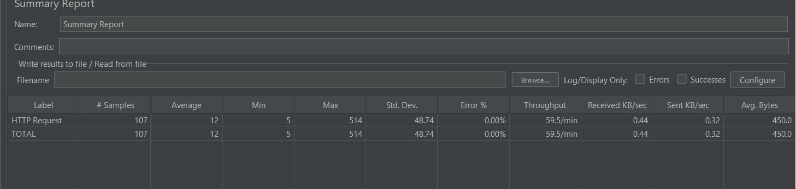
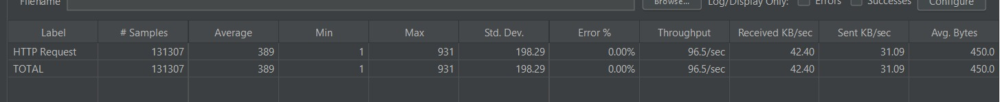

# 🏗️ Multi-Tenant SaaS Backend

<div align="center">


**A production-style multi-tenant backend system built with Spring Boot — featuring row-level data isolation, JWT-based RBAC, Redis caching, and an asynchronous webhook engine with exponential backoff retry.**

> 🔥 Stress-tested backend handling **146K+ requests** with **~99 req/sec throughput** and controlled degradation under load.

[Features](#-features) • [Architecture](#-architecture) • [Getting Started](#-getting-started) • [API Reference](#-api-reference) • [Performance](#-performance-results) • [Roadmap](#-roadmap)

</div>

---

## 🏆 Key Achievements

- Handled **146K+ requests** under structured JMeter load testing
- Achieved **~99 req/sec peak throughput** on a single local node
- Maintained **0% error rate up to ~85–90 req/sec** stable zone
- Identified system saturation and breaking point with graceful degradation
- Implemented **multi-tenancy + Redis caching + RBAC + async webhooks** in a single cohesive system

---

## 📌 Overview

This project implements a **multi-tenant SaaS backend** where each tenant's data is strictly isolated at the database row level using Hibernate filters. The system is designed for scalability, security, and reliability — validated through structured JMeter load testing across 146,000+ requests.

### Why This Architecture?

| Problem | Solution |
|---|---|
| Multiple clients sharing one DB | Hibernate `@Filter` with `tenantId` on every query |
| Role-based access control | JWT claims + Spring `@PreAuthorize` with `hasAuthority()` |
| Slow repeated DB reads | Redis `@Cacheable` with 10-minute TTL |
| Unreliable webhook delivery | Async send + scheduled retry with exponential backoff |
| Token bloat / session state | Stateless JWT — no server-side session storage |

---

## ✨ Features

- 🏢 **Multi-Tenancy** — Row-level isolation via Hibernate `@FilterDef` / `@Filter`. Every repository call is automatically scoped to the current tenant via AOP.
- 🔐 **JWT Authentication** — Stateless token-based auth. Tokens carry `username`, `role`, and `tenantId` as claims.
- 🛡️ **RBAC** — Role-Based Access Control using Spring Security's `@PreAuthorize("hasAuthority('ROLE_ADMIN')")`. Supports `ADMIN` and `USER` roles out of the box.
- ⚡ **Redis Caching** — `GET /api/users` responses cached with a 10-minute TTL. Cache is evicted automatically on user creation.
- 🔔 **Async Webhook Engine** — Webhooks are persisted, sent asynchronously via `@Async`, and retried on failure using `@Scheduled` with exponential backoff (max 3 retries before `PERMANENT_FAILED`).
- 🔏 **HMAC Signature Verification** — Webhook payloads are signed with HMAC-SHA256 via `X-Signature` header, enabling receivers to verify authenticity.
- 📊 **Load Tested** — Verified stable at ~90 req/sec with 0% error rate across 100+ concurrent users on a single local node.

---

## 🏛️ Architecture

```
┌─────────────────────────────────────────────────────────┐
│                        CLIENT                           │
│              (Postman / Frontend / SDK)                 │
└──────────────────────┬──────────────────────────────────┘
                       │ HTTPS
                       ▼
┌─────────────────────────────────────────────────────────┐
│                   SPRING BOOT APP                       │
│                                                         │
│  ┌─────────────┐   ┌──────────────┐  ┌──────────────┐   │
│  │  JwtFilter  │── │SecurityConfig│  │TenantFilter  │   │
│  │  (per req)  │   │ (RBAC rules) │  │Aspect (AOP)  │   │
│  └─────────────┘   └──────────────┘  └──────────────┘   │
│         │                                    │          │
│         ▼                                    ▼          │
│  ┌─────────────────────────────────────────────────┐    │
│  │              REST Controllers                   │    │
│  │   AuthController  UserController  WebhookCtrl   │    │
│  └──────────────────────┬──────────────────────────┘    │
│                         │                               │
│         ┌───────────────┼───────────────┐               │
│         ▼               ▼               ▼               │
│  ┌─────────────┐ ┌──────────┐  ┌──────────────────┐     │
│  │ UserService │ │WebhookSvc│  │  Redis Cache     │     │
│  │ @Cacheable  │ │  @Async  │  │  (10 min TTL)    │     │
│  └──────┬──────┘ └────┬─────┘  └──────────────────┘     │
│         │             │                                 │
└─────────┼─────────────┼──────────────────────────────── ┘
          │             │
          ▼             ▼
   ┌────────────┐  ┌──────────────────────────┐
   │ PostgreSQL │  │  WebhookRetryScheduler   │
   │  (saas_db) │  │  @Scheduled every 10s    │
   └────────────┘  │  Exponential Backoff     │
                   └──────────────────────────┘
```

### Key Design Decisions

**1. Tenant Isolation via AOP + Hibernate Filter**
Rather than adding `WHERE tenant_id = ?` to every query manually, a `@Before` AOP advice intercepts all repository calls and enables a Hibernate session-level filter automatically. Zero chance of accidentally leaking cross-tenant data.

**2. `hasAuthority()` over `hasRole()`**
With custom JWT filters (no `UserDetailsService`), Spring's `hasRole()` abstraction can silently fail. This project uses `hasAuthority('ROLE_ADMIN')` for direct, reliable authority matching.

**3. Webhook Persistence Before Send**
Webhooks are saved to DB with `PENDING` status *before* being sent. This ensures no event is ever lost — even if the app crashes mid-send, the retry scheduler picks it up.

---

## 🗂️ Project Structure

```
src/main/java/com/saas/backend/
│
├── config/
│   ├── SecurityConfig.java        # JWT filter chain, RBAC, CORS
│   ├── RedisConfig.java           # RedisCacheManager with TTL
│   └── WebConfig.java             # MVC interceptor registration
│
├── controller/
│   ├── AuthController.java        # POST /api/auth/login
│   └── UserController.java        # GET/POST /api/users, GET /api/users/me
│
├── entity/
│   ├── BaseEntity.java            # tenantId + Hibernate @Filter
│   └── User.java                  # User entity (Serializable for Redis)
│
├── security/
│   ├── JwtFilter.java             # Token extraction, auth context setup
│   └── JwtUtil.java               # Token generation and claims parsing
│
├── service/
│   └── UserService.java           # @Cacheable getAllUsers, @CacheEvict createUser
│
├── tenant/
│   ├── TenantContext.java         # ThreadLocal tenant store
│   ├── TenantFilterAspect.java    # AOP: auto-applies Hibernate filter
│   └── TenantInterceptor.java     # Cleans up ThreadLocal after request
│
├── webhook/
│   ├── Webhook.java               # Entity: url, payload, status, retryCount
│   ├── WebhookService.java        # @Async send + HMAC signing
│   ├── WebhookRetryScheduler.java # @Scheduled retry with backoff
│   └── WebhookRepository.java     # Query by status + nextRetryTime
│
└── util/
    └── SignatureUtil.java         # HMAC-SHA256 signature generation
```

---

## 🚀 Getting Started

### Prerequisites

| Tool | Version |
|---|---|
| Java | 17+ |
| Maven | 3.8+ |
| PostgreSQL | 14+ |
| Redis | 7+ |

### 1. Clone the Repository

```bash
git clone https://github.com/your-username/saas-backend.git
cd saas-backend
```

### 2. Configure PostgreSQL

```sql
CREATE DATABASE saas_db;
```

### 3. Configure `application.properties`

```properties
# PostgreSQL
spring.datasource.url=jdbc:postgresql://localhost:5432/saas_db
spring.datasource.username=your_username
spring.datasource.password=your_password

# Redis
spring.data.redis.host=localhost
spring.data.redis.port=6379
spring.cache.type=redis

# JPA
spring.jpa.hibernate.ddl-auto=update
spring.jpa.show-sql=true
```

### 4. Start Redis

```bash
# macOS
brew services start redis

# Ubuntu/Debian
sudo systemctl start redis

# Windows (via WSL or Docker)
docker run -d -p 6379:6379 redis
```

### 5. Run the Application

```bash
mvn spring-boot:run
```

On startup, a seed user is automatically created:

```
username : admin
password : 1234
tenantId : company1
role     : ADMIN
```

---

## 📡 API Reference

### Authentication

#### `POST /api/auth/login`

```json
// Request
{
  "username": "admin",
  "password": "1234",
  "tenantId": "company1"
}

// Response 200 OK
{
  "token": "eyJhbGciOiJIUzI1NiJ9..."
}
```

Use the returned token as `Authorization: Bearer <token>` on all protected routes.

---

### Users

| Method | Endpoint | Role Required | Description |
|---|---|---|---|
| `GET` | `/api/users` | `ADMIN` | List all users for current tenant |
| `POST` | `/api/users` | `ADMIN` | Create a new user |
| `GET` | `/api/users/me` | `ADMIN` or `USER` | Get own profile from JWT context |
| `GET` | `/api/users/debug` | `ADMIN` | Inspect current auth + authorities |

#### `GET /api/users` — Sample Response

```json
[
  {
    "tenantId": "company1",
    "id": 1,
    "username": "admin",
    "role": "ADMIN"
  },
  {
    "tenantId": "company1",
    "id": 2,
    "username": "user1",
    "role": "USER"
  }
]
```

#### `POST /api/users` — Create User

```json
// Request Body
{
  "username": "newuser",
  "password": "pass123",
  "role": "USER"
}
// tenantId is automatically set from the JWT — no manual input needed
```

---

### Webhooks

Webhooks are triggered automatically on user creation and retried up to 3 times with exponential backoff on failure.

| Status | Meaning |
|---|---|
| `PENDING` | Saved, not yet sent |
| `PROCESSING` | Currently being sent |
| `SUCCESS` | Delivered successfully |
| `FAILED` | Send failed, pending retry |
| `PERMANENT_FAILED` | Max retries exceeded |

Every webhook request includes an `X-Signature` header (HMAC-SHA256) for payload verification.

---

## 📊 Performance Results

> Tested with Apache JMeter on a single local node (Spring Boot + PostgreSQL + Redis)

| Test | Requests | Avg Latency | Throughput | Error % |
|---|---|---|---|---|
| Initial Load | 107 | 12 ms | 1 req/s | 0% |
| Moderate Load | 1,307 | 9 ms | 4.2 req/s | 0% |
| Medium Load | 5,307 | 62 ms | 7.7 req/s | 0% |
| High Load | 21,307 | 136 ms | 23.5 req/s | 0% |
| Heavy Load | 37,307 | 190 ms | 39.8 req/s | 0% |
| Peak Load | 111,307 | 337 ms | 86.5 req/s | 0% |
| **Saturation** | **131,307** | **389 ms** | **96.5 req/s** | **0%** |
| **Breaking Point** | **146,307** | **462 ms** | **~99 req/s** | **0.08%** |

### 📊 Performance Graphs

#### ✅ Stable Zone (0% Errors)


#### ⚠️ Saturation Zone


#### ❌ Breaking Point


## 🎯 System Capacity

| Zone | Throughput | Latency | Behaviour |
|---|---|---|---|
| 🟢 Stable | 0 – 85 req/sec | < 300 ms | Zero errors, optimal performance |
| 🟡 Saturation | 85 – 100 req/sec | 300 – 450 ms | Slower responses, no failures |
| 🔴 Breaking | ~100 req/sec+ | > 450 ms | Errors begin, throughput plateaus |

### Key Findings

- ✅ **Stable zone:** 0–85 req/sec, latency < 300ms, 0% error
- ⚠️ **Saturation zone:** 85–100 req/sec, latency 300–450ms
- ❌ **Breaking point:** ~99 req/sec, first errors at 0.08%
- 📈 **Linear scalability** with no sudden crash — graceful degradation under extreme load
-⚡ Redis caching significantly reduces latency for repeated reads under low to moderate load
---

## 🧠 Key Learnings

- **Redis caching** significantly reduces response latency — repeated reads served in under 10ms vs 60ms+ from DB
- **Database indexing** on `tenant_id` improves query performance under concurrent load
- **System saturation** occurs gradually due to CPU + DB connection pool contention — not a single hard limit
- **Proper backend systems degrade gracefully** — latency climbs before errors appear, giving time to scale
- **`hasAuthority()` over `hasRole()`** — with custom JWT filters, direct authority matching is more reliable than Spring's abstraction layer

---

## ⚠️ Limitations

- Tests performed on a **single local machine** — production throughput would be significantly higher
- Throughput ceiling (~99 req/sec) is bounded by **local CPU and connection pool** limits, not the architecture
- **No think time** between requests — simulates worst-case sustained load, not realistic user behaviour
- Production deployment would require **horizontal scaling**, load balancer, and connection pool tuning (HikariCP)

---

## 🔐 Security Model

```
Request
  │
  ▼
JwtFilter
  ├── Extract Bearer token from Authorization header
  ├── Validate signature + expiry via JwtUtil
  ├── Parse claims: username, role, tenantId
  ├── Set TenantContext (ThreadLocal)
  └── Set SecurityContextHolder with SimpleGrantedAuthority("ROLE_X")
  │
  ▼
Spring Security
  └── @PreAuthorize("hasAuthority('ROLE_ADMIN')")
        ├── PASS → Controller executes
        └── FAIL → 403 Forbidden
  │
  ▼
TenantFilterAspect (AOP)
  └── Before any repository call → enableFilter("tenantFilter")
        └── All queries scoped to current tenant automatically
  │
  ▼
TenantInterceptor.afterCompletion()
  └── TenantContext.clear() — ThreadLocal cleanup
```

---

## 🛠️ Tech Stack

| Layer | Technology |
|---|---|
| Language | Java 17 |
| Framework | Spring Boot 3.x |
| Security | Spring Security + JWT (JJWT) |
| Database | PostgreSQL 16 |
| Cache | Redis 7 + Spring Cache |
| ORM | Spring Data JPA + Hibernate |
| Multi-tenancy | Hibernate `@FilterDef` + AOP |
| Async | Spring `@Async` + `@Scheduled` |
| Build | Apache Maven |
| Testing | JMeter (load), JUnit (unit) |

---

## 🗺️ Roadmap

- [ ] **BCrypt password encoding** — replace plain-text comparison
- [ ] **Tenant onboarding API** — `POST /api/tenants` with schema provisioning
- [ ] **Refresh token support** — sliding session without re-login
- [ ] **Rate limiting** — per-tenant request throttling via Bucket4j
- [ ] **Prometheus + Grafana** — real-time metrics dashboard
- [ ] **Docker Compose** — one-command local setup
- [ ] **CI/CD pipeline** — GitHub Actions with test + build stages

---

## 🤝 Contributing

Pull requests are welcome. For major changes, please open an issue first to discuss what you would like to change.

```bash
# Fork → Clone → Branch
git checkout -b feature/your-feature-name

# Make changes → Commit
git commit -m "feat: add your feature"

# Push → Open PR
git push origin feature/your-feature-name
```

---

## 📄 License

This project is licensed under the MIT License — see the [LICENSE](LICENSE) file for details.

---

<div align="center">

Built with ☕ and way too many JWT debugging sessions.

⭐ **Star this repo if you found it useful!**

</div>
